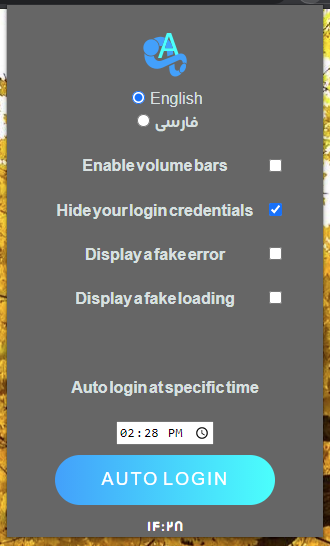
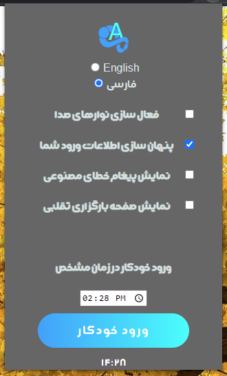

# SkyRoomAssistant
<a href="https://chrome.google.com/webstore/detail/skyroom-assistant/ljdankmhmhhaadaidbaddioidnfdikdg">**Download**</a> **From Chrome WebStore**  
A Chrome Extension for SkyRoom streaming platform  

### Options
- Login automation (at a specific time)
- Adding volume Bars (you will be able to manage each person voice volume)
- Hiding login credentials (it will pretend leaking your username)
- Appearing fake error ("Error on connecting to the server!")
- Appearing fake frozen loading screen

## Sample Pics:

